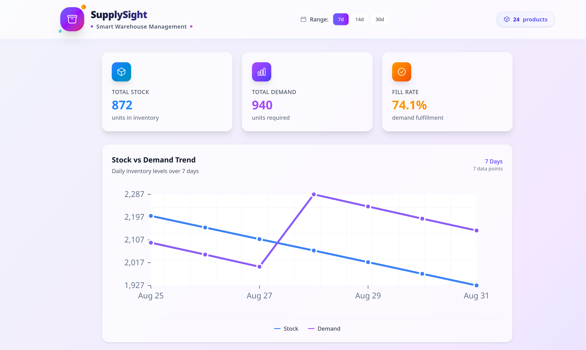
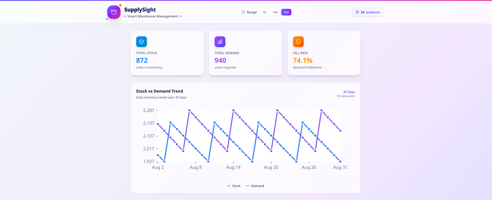
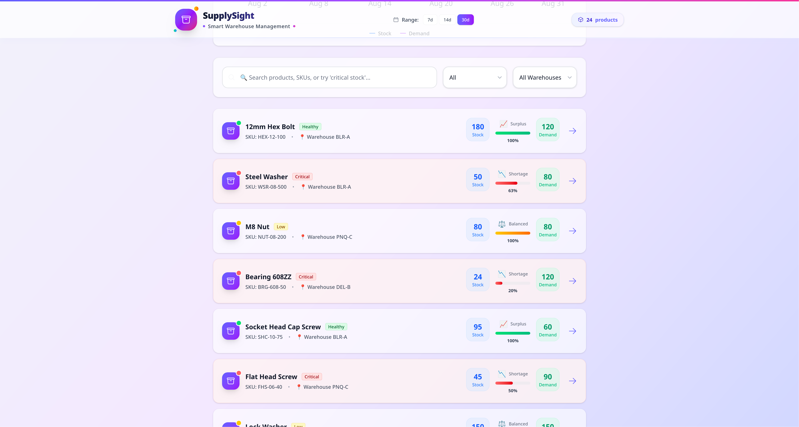
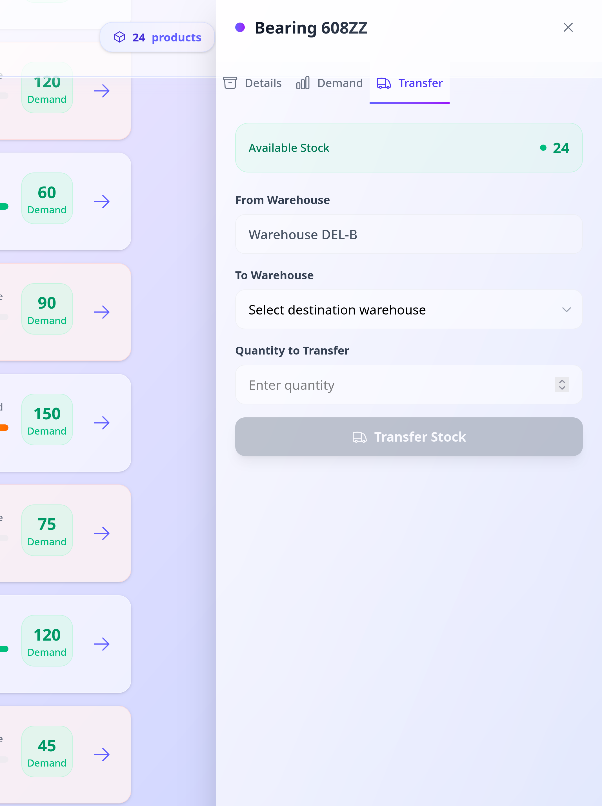
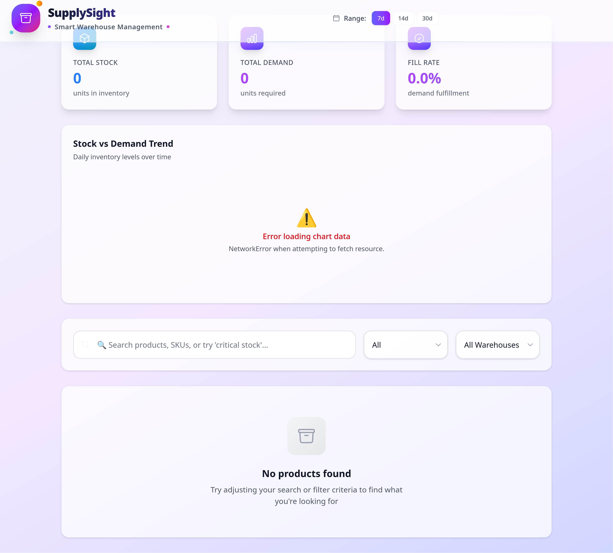

# SupplySight - Smart Warehouse Management
SupplySight project is a Smart Warehouse Management application designed to help manage and monitor product inventory and demand levels across warehouses. with features of a dashboards display stock/demand trends, A Product Inventory List for viewing current stock levels, Functionality to update a product's demand level and transfer stock between different warehouses.
## 📸 Screenshots

Here are some of the key features of the application.

### 1. Main Dashboard (7-Day Trend)

### 2. Dashboard (30-Day Trend)

### 3. Product Inventory List

### 4. Update Demand Level

### 5. Transfer Stock Between Warehouses

### 5. Error 

## 💻 Tech Stack

-   **Language:** [TypeScript](https://www.typescriptlang.org/)
-   **Frontend Framework:** [React](https://reactjs.org/)
-   **Styling:**[Tailwind CSS](https://tailwindcss.com/) _(or specify your choice)_
-   **Build Tool:** [Vite](https://vitejs.dev/)
